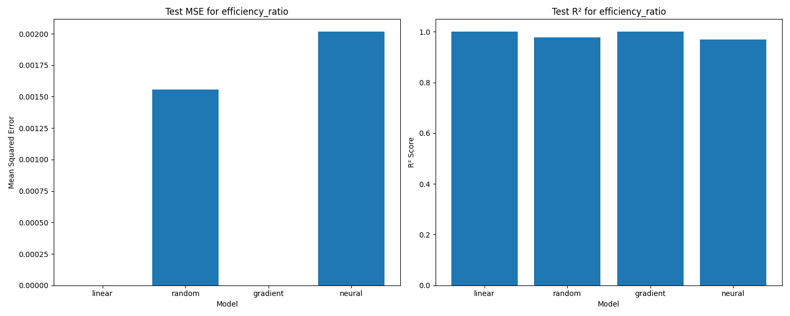
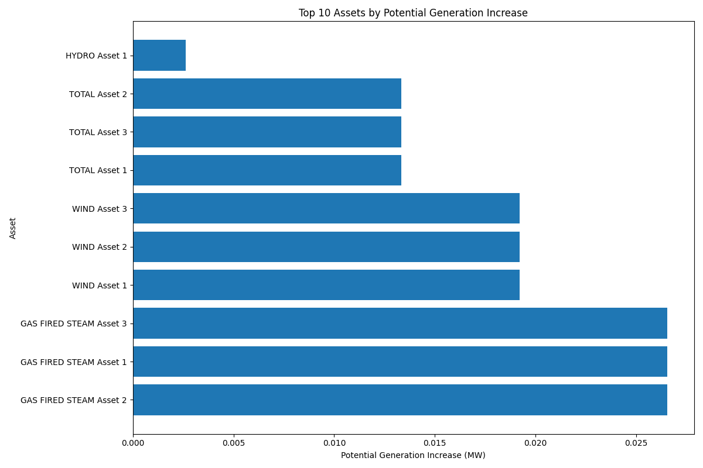
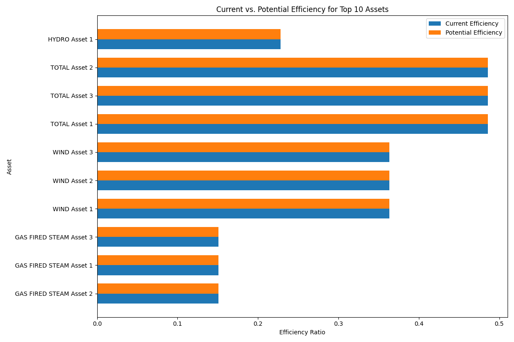
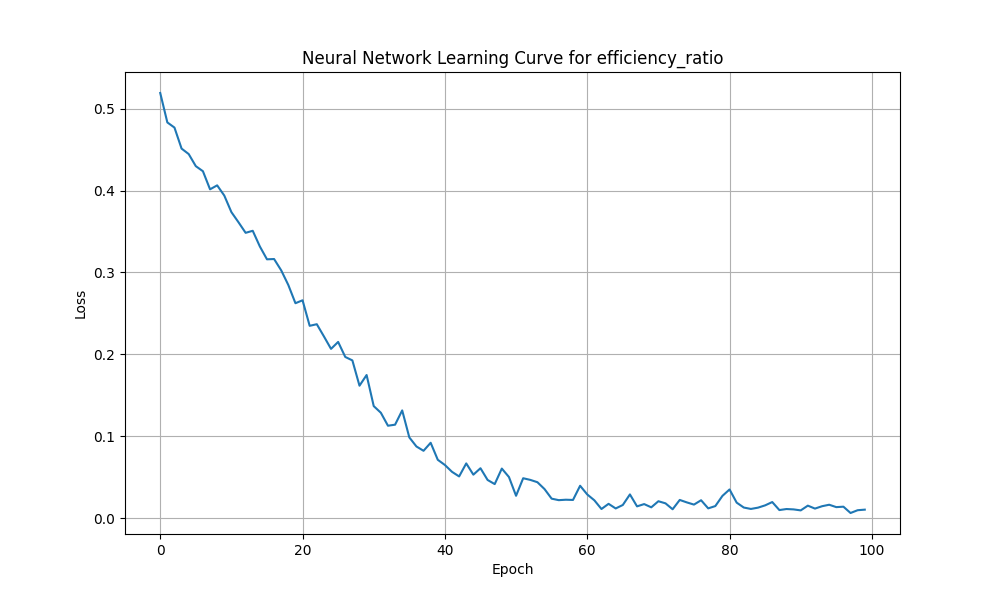
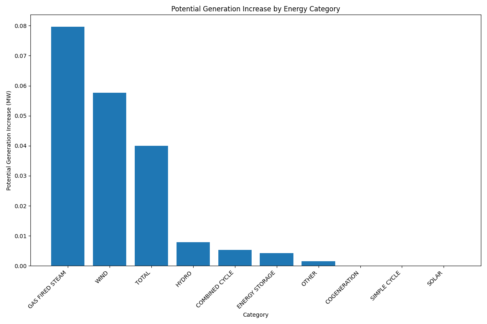

# ⚡ DataGrid Energy Predictor


I built this project to analyze the **Alberta electrical grid** and figure out which energy assets are underperforming — and by how much. The goal was to give grid operators something actionable: a ranked list of assets where efficiency improvements would have the biggest impact.

---

## 💡 Why I Built This

Alberta's power grid has hundreds of assets — gas plants, wind farms, solar, hydro, cogeneration — each with a rated maximum capacity. But in practice, most of them run well below that. I wanted to answer three questions:

- Which assets have the biggest gap between what they *could* produce and what they *actually* produce?
- What features best predict how efficiently an asset is running?
- How much total generation is being left on the table across the grid?

---

## 🏗️ How It Works

I built a full pipeline from raw PDF to recommendations:

```
CSDReportServlet.pdf  (Alberta Supply/Demand Report)
         │
         ▼
 ┌─────────────────────┐
 │  PDF Data Extractor │  ← PyPDF2 + regex
 │  pdf_data_extractor │
 └────────┬────────────┘
          │  CSV files (summary, generation groups, assets)
          ▼
 ┌──────────────────────────┐
 │  Feature Analysis        │  ← Correlation, RFE, Lasso,
 │  feature_correlation_    │    Random Forest, PCA,
 │  analysis.py             │    Mutual Info, Permutation
 └────────┬─────────────────┘
          │  Selected features
          ▼
 ┌──────────────────────────┐
 │  ML / DL Models          │  ← Linear Regression
 │  energy_optimizer.py     │    Random Forest
 │                          │    XGBoost
 │                          │    PyTorch Neural Network
 └────────┬─────────────────┘
          │
          ▼
 ┌──────────────────────────┐
 │  Reports & Visualizations│  ← Ranked recommendations
 │  plots/ · reports/       │    Efficiency comparison charts
 └──────────────────────────┘
```

---

## 📊 Results

| What | Numbers |
|------|---------|
| Assets analyzed | 25+ across 8 categories |
| Models I trained | 4 — Linear Regression, Random Forest, XGBoost, PyTorch NN |
| Feature selection methods I used | 6 — F-test, Mutual Info, RFE, Lasso, RF Importance, Permutation |
| Targets predicted | Efficiency Ratio · Optimization Potential (MW) |

### Visualizations

| Model Comparison | Top Assets by Potential | Efficiency Comparison |
|:-:|:-:|:-:|
|  |  |  |

| Neural Network Learning Curve | Category Potential |
|:-:|:-:|
|  |  |

---

## 🔍 Feature Selection

I ran six different feature selection methods independently and cross-referenced the results. Features selected by multiple methods give me more confidence they're genuinely predictive.

**For Efficiency Ratio:**
- Most important: `total_net_generation`, `category_COGENERATION`, `category_ENERGY STORAGE`, `category_SOLAR`
- Also useful: `dispatched_contingency_reserve`, `category_WIND`

**For Optimization Potential:**
- Most important: `maximum_capability`, `total_net_generation`, `dispatched_contingency_reserve`
- Also useful: `category_OTHER`, `category_WIND`

Full analysis → [`feature_analysis_report.md`](energy_optimization/feature_analysis_report.md)

---

## 🚀 Running It Yourself

### What You Need

- Python 3.8+
- The Alberta CSD Report PDF (`CSDReportServlet.pdf`) in the project root
  - Get it from [AESO Current Supply & Demand](https://www.aeso.ca/market/market-and-system-reporting/data-requests/current-supply-and-demand/)

### Setup

```bash
git clone https://github.com/ManojYMK/DataGrid_EnergyPredictor.git
cd DataGrid_EnergyPredictor/energy_optimization
pip install -r requirements.txt
```

### Run the Full Pipeline

```bash
# Option 1: Shell script
chmod +x run_optimization.sh
./run_optimization.sh

# Option 2: Run directly
python main.py
```

### Just the Feature Analysis

```bash
python run_feature_analysis.py
```

### Interactive Notebook

```bash
jupyter notebook energy_optimization_walkthrough.ipynb
```

---

## 📁 Project Structure

```
DataGrid_EnergyPredictor/
├── CSDReportServlet.pdf                   # Alberta grid report (add manually)
├── README.md
└── energy_optimization/
    ├── main.py                            # Runs the full pipeline
    ├── pdf_data_extractor.py              # Pulls data out of the PDF
    ├── energy_optimizer.py                # ML/DL training and recommendations
    ├── feature_correlation_analysis.py    # Feature selection suite
    ├── run_feature_analysis.py            # Runs the feature analysis
    ├── energy_optimization_walkthrough.ipynb  # Interactive notebook
    ├── requirements.txt
    ├── data/                              # Extracted CSVs
    ├── plots/                             # Charts I generated
    ├── feature_analysis/                  # Feature selection outputs
    └── reports/
        └── optimization_report.txt
```

---

## 🛠️ Tech Stack

| Category | What I Used |
|----------|-------------|
| Deep Learning | PyTorch |
| Machine Learning | scikit-learn, XGBoost |
| Data Processing | pandas, numpy |
| Visualization | matplotlib, seaborn |
| PDF Extraction | PyPDF2, regex |
| Academic Writing | LaTeX |

---

## 📄 Research Component

I also wrote LaTeX documents alongside this project covering the methodology, feature selection approach, and model performance analysis — mostly to practice communicating the technical work clearly.

---

## 📜 License

MIT — see [LICENSE](LICENSE)

---

## 👤 Author

**Manoj YMK** · [GitHub](https://github.com/ManojYMK)
