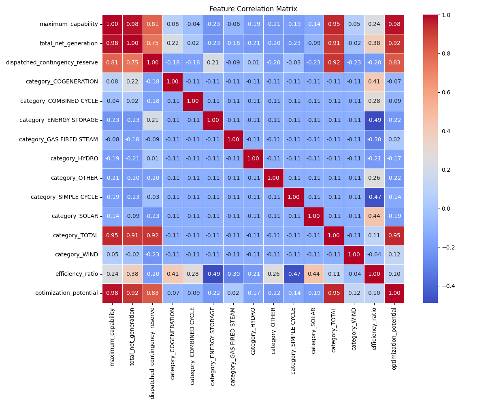
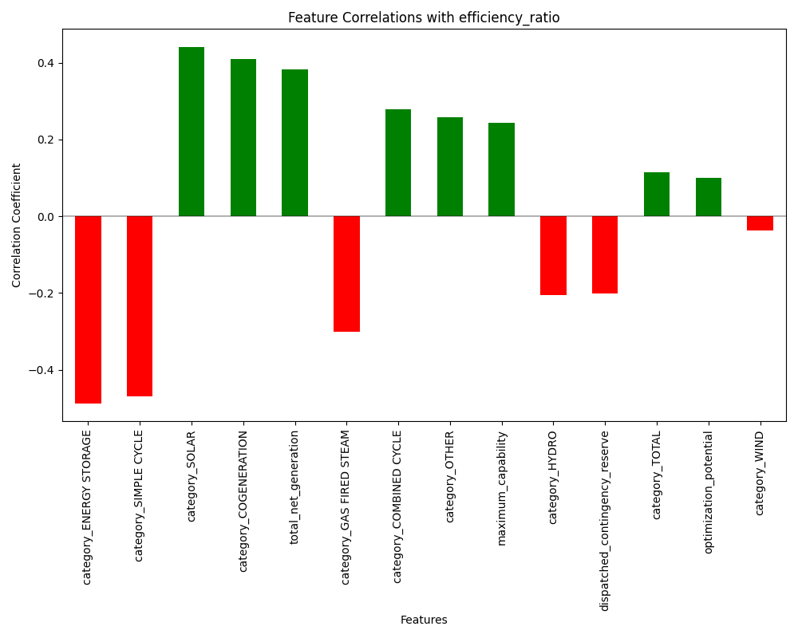
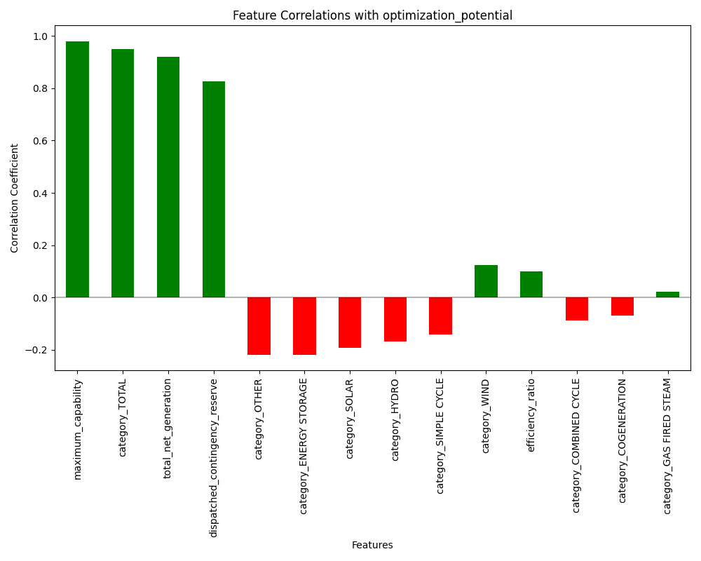
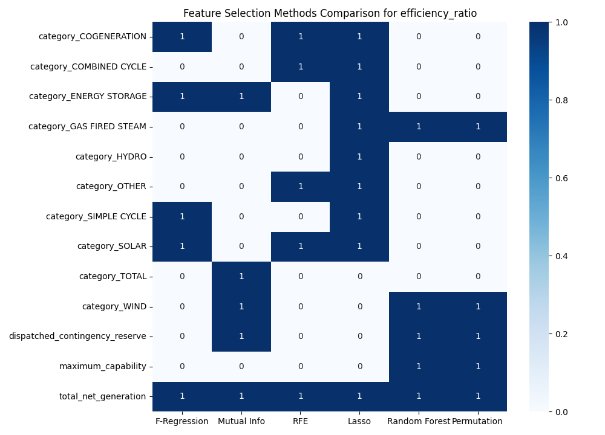
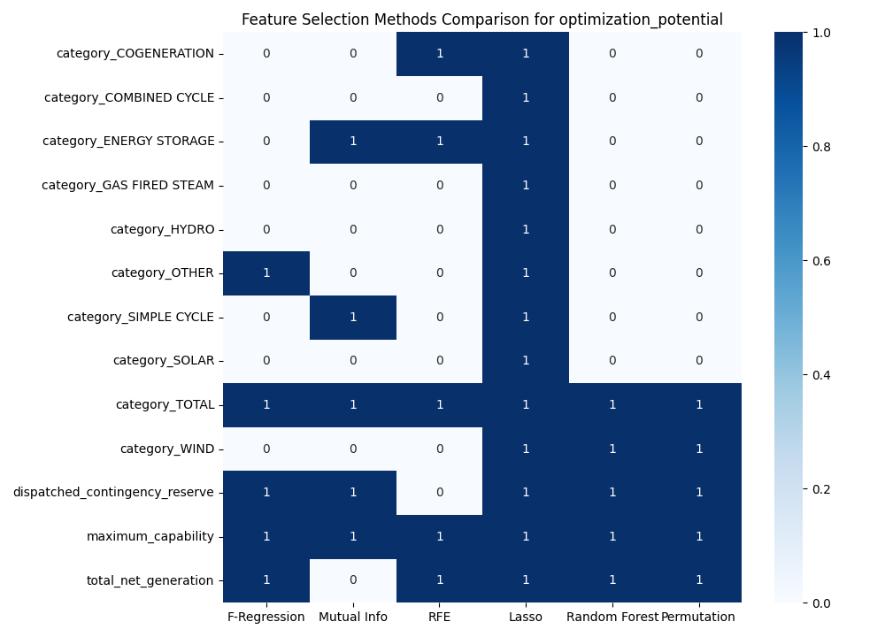
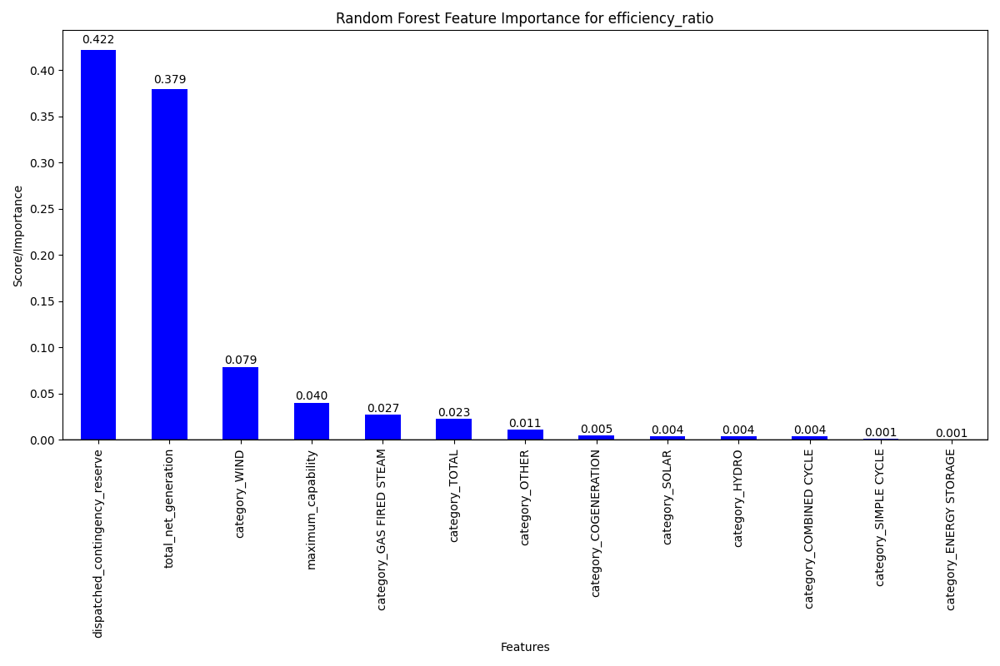
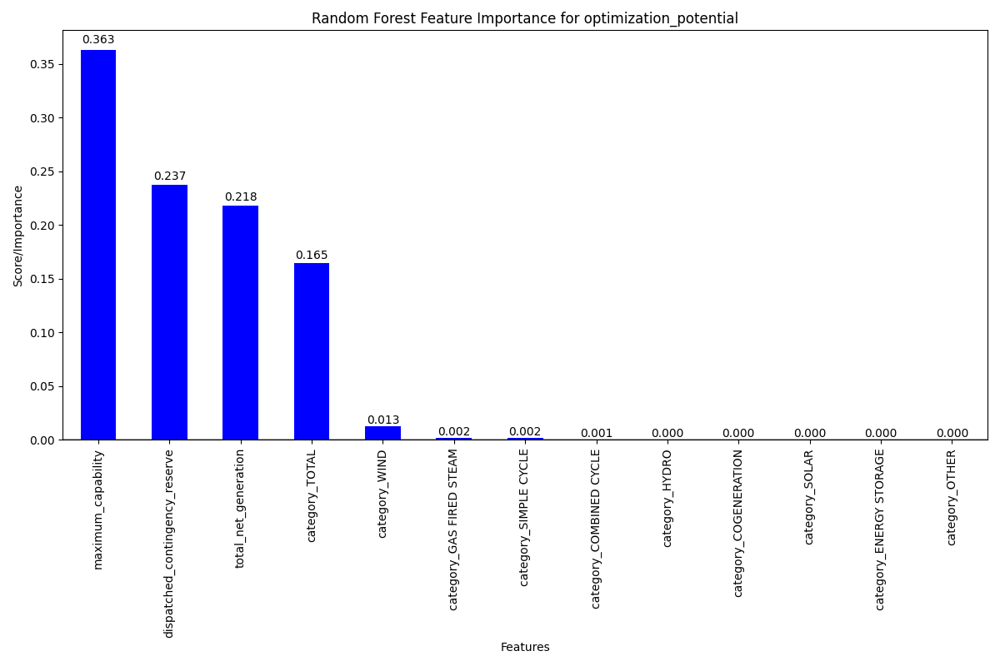

# Feature Correlation Analysis and Selection Report

## Executive Summary

This report presents the findings from a comprehensive feature correlation analysis and feature selection study for the Alberta Energy Optimization system. The analysis focused on identifying the relationships between various input features and two key target variables: efficiency ratio and optimization potential. Multiple feature selection techniques were employed to determine the most significant features for predicting these targets.

## Correlation Analysis

### Key Correlations

#### Efficiency Ratio Correlations

| Feature | Correlation |
|---------|-------------|
| category_ENERGY STORAGE | -0.4879 |
| category_SIMPLE CYCLE | -0.4690 |
| category_SOLAR | 0.4413 |
| category_COGENERATION | 0.4102 |
| total_net_generation | 0.3819 |

#### Optimization Potential Correlations

| Feature | Correlation |
|---------|-------------|
| maximum_capability | 0.9800 |
| category_TOTAL | 0.9496 |
| total_net_generation | 0.9196 |
| dispatched_contingency_reserve | 0.8264 |
| category_OTHER | -0.2192 |

## Feature Selection Results

Multiple feature selection techniques were applied:
1. **Filter methods**: F-regression and Mutual Information
2. **Wrapper methods**: Recursive Feature Elimination (RFE) with Linear Regression
3. **Embedded methods**: Lasso Regression, Random Forest, and Permutation Importance
4. **Dimensionality reduction**: Principal Component Analysis (PCA)

### Feature Selection Methods Comparison - Efficiency Ratio

### Feature Selection Methods Comparison - Optimization Potential

### Random Forest Feature Importance - Efficiency Ratio

### Random Forest Feature Importance - Optimization Potential

## Recommendations

Based on the analysis, we recommend the following features for model development:

### For Efficiency Ratio Models:

1. **Primary Features** (selected by multiple methods):
   - total_net_generation
   - category_COGENERATION
   - category_ENERGY STORAGE
   - category_SOLAR

2. **Secondary Features**:
   - dispatched_contingency_reserve
   - category_WIND
   - category_GAS FIRED STEAM

### For Optimization Potential Models:

1. **Primary Features** (selected by multiple methods):
   - maximum_capability
   - category_TOTAL
   - total_net_generation
   - dispatched_contingency_reserve

2. **Secondary Features**:
   - category_OTHER
   - category_WIND

## Conclusion

This feature correlation and selection analysis has identified the most important features for predicting efficiency ratio and optimization potential. By focusing on these key features, we can develop more accurate and interpretable models while potentially reducing model complexity.

The comprehensive approach using multiple feature selection methods increases confidence in our findings, as features selected by multiple methods are likely to be truly important for the prediction tasks.